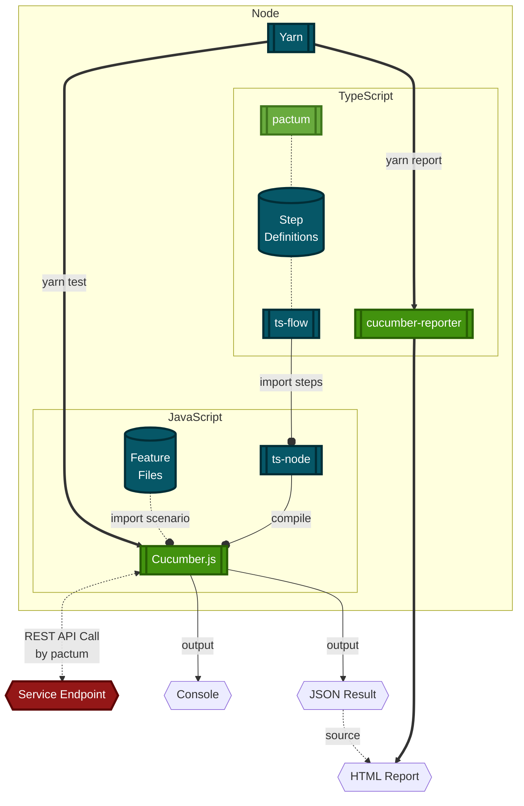

# DAY1 Tech-Stack

- [DAY1 Tech-Stack](#day1-tech-stack)
  - [Overview](#overview)
  - [Independent Application Functional Testing Stack](#independent-application-functional-testing-stack)
  - [Independent Application Development Stack](#independent-application-development-stack)

## Overview

```mermaid
%%{ init: { "fontFamily": "Noto Sans KR, sans-serif" } }%%
flowchart LR
  %% Style
  classDef Core color:#ffffff,fill:#69ab3e,stroke:#3f761c,stroke-width:3px
  classDef Support color:#ffffff,fill:#065767,stroke:#012e37,stroke-width:3px
  
  style BDD/system-behavior stroke-width:4px
  style DAY1 stroke-width:4px
  style DAY2 stroke-width:4px

  %% Group
  subgraph BDD/system-behavior
    direction BT
    day1Bdd{{ Cucumber.js }}:::Core
    day1Feature[( Feature\nFiles )]:::Support
    day1Steps[( Step\nDefinitions )]:::Support
  end
%%  subgraph STUB/system-stub
%%    direction BT
%%    day1Mock[( Mocked Contracts )]:::Support
%%    day1Stub{{" Mountebank.js\n(imposter) "}}:::Core
%%  end
  subgraph APP
    subgraph DAY1
      direction TB
      day1EP[[ Bundled Service Endpoint ]]
      day1{{ SpringBoot }}:::Core
      day1FW[[ Flyway ]]:::Support
      day1DB[( PostgreSQL )]:::Support
    end
    subgraph DAY2
      direction TB
      day2EP[[ Bundled Service Endpoint ]]
      day2{{ SpringBoot }}:::Core
    end
  end

  %% Link
  day1Feature -.- day1Steps
  day1Feature & day1Steps --> day1Bdd

%%  STUB/system-stub -..->|Recording| APP
%%  day1Mock --> day1Stub

  BDD/system-behavior ===>|E2E Scenario\non Runtime| APP %% & STUB/system-stub
  day1EP --o|":8081"| day1 ==> day1DB
  day1FW -.->|DDL| day1DB
  day1FW -.->|DML| day1DB

  day1 ===>|REST API CALL| DAY2
  day2EP --o|":8082"| day2
```

## Independent Application Functional Testing Stack



- **Read more**:

  - [BDD Structure](build-src/system-behavior/README.md#structure)
    sequence diagram

  - [Stub Structure](build-src/system-stub/README.md#structure)
    sequence diagram

## Independent Application Development Stack

```mermaid
%%{ init: { "fontFamily": "Noto Sans KR, sans-serif" } }%%
flowchart TB %% Top to Bottom
  %% Style
  classDef Role color:#050505,fill:#fad7ac,stroke:#be7a26,stroke-width:3px
  classDef Support color:#ffffff,fill:#065767,stroke:#012e37,stroke-width:3px
  classDef Core color:#ffffff,fill:#69ab3e,stroke:#3f761c,stroke-width:3px
  classDef Process color:#ffffff,fill:#42920e,stroke:#286003,stroke-width:3px
  classDef OCI color:#ffffff,fill:#2e72b8,stroke:#17395c,stroke-width:3px
  classDef OCIProcess color:#ffffff,fill:#1063b7,stroke:#07325e,stroke-width:3px
  classDef Target color:#ffffff,fill:#941717,stroke:#5e0707,stroke-width:3px

  %% Group
  subgraph Local Network
    direction TB
    WFDEV( Developer \n who focus \n the Workflow ):::Role
    subgraph Containerization
      direction TB
      Containerize[[ Dockerfile ]]:::Support
      ENV( Environment Vairables ):::Support
      OCI(( Container \n Image )):::OCI
      CRI[[ Container Runtime ]]:::OCIProcess
      APPDEV( Developer \n who focus \n the AppLogic ):::Role
      subgraph Java
        direction TB
        Config( Configuration ):::Support
        Spring([ Spring Framework ]):::Core
        Boot{{ SpringBoot Application }}:::Core
        Jar( Bundled Jar )
        BootProcess[[ SpringBoot Process ]]:::Process
        BootEndpoint{{ Bundled Service Endpoint }}
          subgraph Groovy
          Gradle[[ Gradle ]]:::Support
          Spock([ Spock Framework ]):::Core
          end
      end
    end
    Compose[[ docker-compose.yaml ]]:::Support
    ContainerEndpoint{{ Containerized Service Endpoint }}:::Target
  end
  Workflow> CI & CD Workflow ]


  %% Link
  WFDEV ---|Collaboration| APPDEV
  Workflow o-.-o|Sustain| WFDEV

  APPDEV --->|Understand business logic| Java
  APPDEV --->|Understand \n virtualizaton| Containerize

  Gradle -.-o Spring & Spock
  Spock -.->|test-suite before bundling| Jar
  Config --> Spring
  Spring ==> Boot ==> Jar
  Jar -->|bootRun| BootProcess
  Jar --> Containerize
  BootProcess --o BootEndpoint

  ENV -->|inject| CRI
  Containerize ---> OCI -->|run| CRI --o ContainerEndpoint
```
