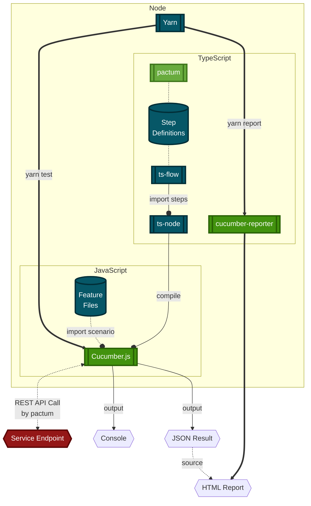

# DAY1 Tech-Stack

- [DAY1 Tech-Stack](#day1-tech-stack)
  - [Overview](#overview)
  - [Independent Application Functional Testing Stack](#independent-application-functional-testing-stack)
  - [Independent Application Development Stack](#independent-application-development-stack)
  - [Technical Stack Keyword](#technical-stack-keyword)
    - [Language](#language)
    - [Package Manager](#package-manager)
    - [Library or Framework](#library-or-framework)

## Overview

```mermaid
%%{ init: { "fontFamily": "Noto Sans KR, sans-serif" } }%%
flowchart LR
  %% Style
  classDef Core color:#ffffff,fill:#69ab3e,stroke:#3f761c,stroke-width:3px
  classDef Support color:#ffffff,fill:#065767,stroke:#012e37,stroke-width:3px
  
  style BDD/system-behavior stroke-width:4px
  style DAY1 stroke-width:4px
  style DAY2 stroke-width:4px

  %% Group
  subgraph BDD/system-behavior
    direction BT
    day1Bdd{{ Cucumber.js }}:::Core
    day1Feature[( Feature\nFiles )]:::Support
    day1Steps[( Step\nDefinitions )]:::Support
  end
%%  subgraph STUB/system-stub
%%    direction BT
%%    day1Mock[( Mocked Contracts )]:::Support
%%    day1Stub{{" Mountebank.js\n(imposter) "}}:::Core
%%  end
  subgraph APP
    subgraph DAY1
      direction TB
      day1EP[[ Bundled Service Endpoint ]]
      day1{{ SpringBoot }}:::Core
      day1FW[[ Flyway ]]:::Support
      day1DB[( PostgreSQL )]:::Support
    end
    subgraph DAY2
      direction TB
      day2EP[[ Bundled Service Endpoint ]]
      day2{{ SpringBoot }}:::Core
    end
  end

  %% Link
  day1Feature -.- day1Steps
  day1Feature & day1Steps --> day1Bdd

%%  STUB/system-stub -..->|Recording| APP
%%  day1Mock --> day1Stub

  BDD/system-behavior ===>|E2E Scenario\non Runtime| APP %% & STUB/system-stub
  day1EP --o|":8081"| day1 ==> day1DB
  day1FW -.->|DDL| day1DB
  day1FW -.->|DML| day1DB

  day1 ===>|REST API CALL| DAY2
  day2EP --o|":8082"| day2
```

## Independent Application Functional Testing Stack



- **Read more**:

  - [BDD Structure](build-src/system-behavior/README.md#structure)
    sequence diagram

  - [Stub Structure](build-src/system-stub/README.md#structure)
    sequence diagram

## Independent Application Development Stack

```mermaid
%%{
  init: {
    'fontFamily': 'Noto Sans KR, sans-serif',
    'curve': 'stepAfter'
  }
}%%
flowchart TB %% Top to Bottom
  %% Link
  Workflow o==o|Sustain| WFFLOW 
  Workflow -.- Compose -.- TeamCollaboration
  Compose --o Containerization

  WFLOGIC ==>|Understand business logic| Java
  WFLOGIC ==>|Understand \n virtualizaton| Containerize

  Gradle -.-> Spring & Spock
  Spock -.->|test-suite before bundling| Jar
  Config --> Spring
  Spring ==> Boot ==> Jar
  Jar -->|bootRun| BootProcess
  Jar ----> Containerize
  BootProcess --> BootEndpoint

  Containerize --> OCI -->|run| CRI
  ENV -->|inject| CRI
  CRI --> ContainerEndpoint

  WFTEST -.->|Bundled \nE2E Testing \n&\n Understand \n business logic| BootEndpoint
  WFTEST ==>|Containerized\nE2E Testing \n&\n Understand \n business logic| ContainerEndpoint

  %% Group
  Workflow> CI & CD Workflow ]
  Compose[[ docker-compose.yaml ]]:::Support
  subgraph Containerization
    direction TB
    subgraph TeamCollaboration
      WFTEST( Tester \n who focus \n the AppTesting ):::Role
      WFFLOW( Engineer \n who focus \n the Workflow ):::Role
      WFLOGIC( Developer \n who focus \n the AppLogic ):::Role
    end
    Containerize[[ Dockerfile ]]:::Support
    ENV( Environment Vairables ):::Support
    OCI(( Container \n Image )):::OCI
    CRI[[ Container Runtime ]]:::OCIProcess
    subgraph Java
      direction TB
      Config( Configuration ):::Support
      Spring([ Spring Framework ]):::Core
      Boot{{ SpringBoot Application }}:::Core
      Jar( Bundled Jar )
      BootProcess[[ SpringBoot Process ]]:::Process
      BootEndpoint{{ Bundled Service Endpoint }}
        subgraph Groovy
        Gradle[[ Gradle ]]:::Support
        Spock([ Spock Framework ]):::Core
        end
    end
    ContainerEndpoint{{ Containerized Service Endpoint }}:::Target
  end

  %% Style
  style Containerization stroke-width:5px
  style TeamCollaboration stroke-width:3px,stroke-dasharray: 6 6 6
  style Java stroke-width:5px
  style Groovy stroke-width:5px

  classDef Role color:#050505,fill:#fad7ac,stroke:#be7a26,stroke-width:3px
  classDef Support color:#ffffff,fill:#065767,stroke:#012e37,stroke-width:3px
  classDef Core color:#ffffff,fill:#69ab3e,stroke:#3f761c,stroke-width:3px
  classDef Process color:#ffffff,fill:#42920e,stroke:#286003,stroke-width:3px
  classDef OCI color:#ffffff,fill:#2e72b8,stroke:#17395c,stroke-width:3px
  classDef OCIProcess color:#ffffff,fill:#1063b7,stroke:#07325e,stroke-width:3px
  classDef Target color:#ffffff,fill:#941717,stroke:#5e0707,stroke-width:3px
```

## Technical Stack Keyword

- [Test pyramid](https://martinfowler.com/articles/practical-test-pyramid.html),
  [Test Double](https://martinfowler.com/bliki/TestDouble.html)
  by [Martin Fowler](https://martinfowler.com/)

### Language

- [JavaScript](https://developer.mozilla.org/ko/docs/Web/JavaScript) + [node.js](https://nodejs.org/en/docs/)

- [TypeScript](https://www.typescriptlang.org/docs/handbook/typescript-in-5-minutes.html)

- [Groovy](https://groovy-lang.org/documentation.html)

### Package Manager

- [Gradle](https://docs.gradle.org/current/userguide/what_is_gradle.html)

- [npm](https://docs.npmjs.com/about-npm) or
  [yarn](https://yarnpkg.com/getting-started) or [yarn berry](https://yarnpkg.com/getting-started/install#initializing-your-project)

### Library or Framework

- [Cucumber School](https://school.cucumber.io/collections) +
  [Cucumber.js](https://cucumber.io/docs/installation/javascript/)

  - [BDD overview for Business Analysts and Product Owners](https://school.cucumber.io/courses/bdd-overview-for-business-analysts-and-product-owners)

  - [BDD with Cucumber (JavaScript)](https://school.cucumber.io/courses/bdd-with-cucumber-javascript)

- [Pactum.js](https://pactumjs.github.io/)

- [Spock Framework](https://spockframework.org/spock/docs/current/index.html)

- [FlyWay](https://flywaydb.org/)
