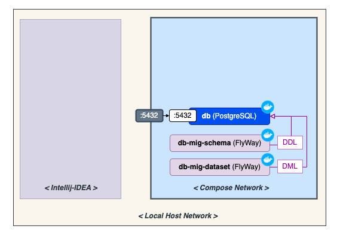
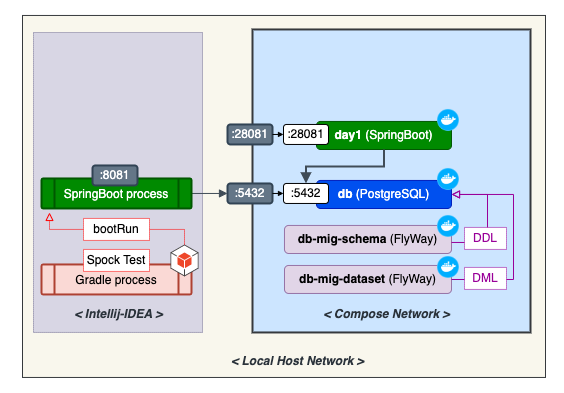
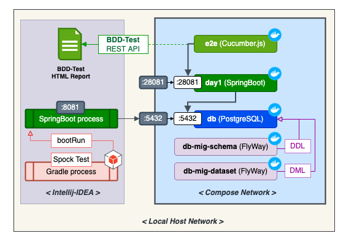

# day1

**Index**

- [day1](#day1)
  - [Overview](#overview)
    - [Architecture](#architecture)
  - [Quickstart](#quickstart)
    - [Prepare Persistency](#prepare-persistency)
    - [Prepare JVM](#prepare-jvm)
    - [Prepare Application](#prepare-application)
    - [Prepare Observability](#prepare-observability)
    - [Try Functional Test on E2E (end-to-end)](#try-functional-test-on-e2e-end-to-end)
  - [Additional Informantions](#additional-informantions)
    - [Useful commands](#useful-commands)
    - [Running Front React app](#running-front-react-app)
    - [References](#references)

## Overview

### Architecture

- [Overview](README.TECH.md#overview)

- [Independent Application **Functional Testing Stack**](README.TECH.md#independent-application-functional-testing-stack)

- [Independent Application **Development Stack**](README.TECH.md#independent-application-development-stack)

## Quickstart

> check [`docker-compose.yml`](./docker-compose.yml)

### Prepare Persistency

```bash
# Create docker volume (only once)
docker volume create --name=db-data

# Start database
docker-compose up -d db

# Execute migration: DB metadata and record
docker-compose run mig-db-schema  # metadata (schema)
docker-compose run mig-db-dataset # record (row)

# (options)
docker-compose build --no-cache \
    mig-db-schema mig-db-dataset
```



### Prepare JVM

Install JDK on [OpenJDK](https://formulae.brew.sh/formula/openjdk#default)
or [Amazon Corretto](https://formulae.brew.sh/cask/corretto)

```bash
# Select JDK11 version
brew install openjdk@11
```

(option) Here are the recommended JVM options on Local & IDE

```bash
-Xms4g
-Xmx4g
-XX:MetaspaceSize=768m
-XX:MaxMetaspaceSize=2g
-XX:MaxGCPauseMillis=200
-XX:ParallelGCThreads=4
-XX:ConcGCThreads=1
-XX:NewRatio=3
-Xss16m
-XX:+AlwaysPreTouch
-XX:+TieredCompilation
-Djava.net.preferIPv4Stack=true
-Djsse.enableSNIExtension=false
```

### Prepare Application

```bash
# Build all
./gradlew clean build

# Start SpringBoot
./gradlew bootRun # :8081
./gradlew other-simple-microservice:bootRun # :8082
```

- Local swagger url on `:8081` : <http://localhost:8081/swagger-ui/index.html>

```bash
# Start SpringBoot container
docker-compose build --no-cache \
    --build-arg HASH_TAG="${APP_VERS:-SNAPSHOT}" \
    day1

# Run the application container
docker-compose up -d day1

# Read log from running application container
docker-compose logs -f day1
```



### Prepare Observability

```bash
# Prepare Supports
docker-compose up -d prometheus grafana
```

[`build-src/system-monitoring/`](./build-src/system-monitoring)

- [`prometheus/prometheus.yml`](./build-src/system-monitoring/prometheus/prometheus.yml)

- [`grafana/datasources/prometheus_ds.yml`](./build-src/system-monitoring/grafana/datasources/prometheus_ds.yml)

### Try Functional Test on E2E (end-to-end)

```bash
# Build E2E container image
docker-compose build --no-cache e2e

# Run E2E container
docker-compose run e2e

# Check report on browser
open ./build-src/system-behavior/outputs/mounts/report/index.html
```

- [`build-src/system-behavior`](./build-src/system-behavior#readme): BDD-suite to test API scenario.

- (option) [`build-src/system-stub`](./build-src/system-stub#readme): Stub-suite to server mocked API.



## Additional Informantions

### Useful commands

```bash
# Remove all dangled images created when build repeatedly
docker rmi $(docker images -f "dangling=true" -q) 2&> /dev/null
```

### Running Front React app

```bash
cd frontend-src
npm ci
npm start
```

### References

- <https://www.baeldung.com/spring-boot-react-crud>
