# system-behavior

The simple BDD suite for day1

## Quick Start

```bash
# (option) Refresh caching on Yarn Berry
yarn cache clean # --all

# Prepare dependencies with Yarn Berry
yarn install --immutable # --immutable-cache --check-cache

# Execute scenario
yarn run test

# Make HTML report with scenario-result
yarn run report
```

## Structure

Check this diagram with the [`package.json`](./package.json) file.

```mermaid
%%{
  init: {
    "fontFamily": "Noto Sans KR, sans-serif",
    "sequence": {
      "showSequenceNumbers": true,
      "noteAlign": "left",
      "noteFontFamily": "Oswald, sans-serif"
    }
  }
}%%
sequenceDiagram
    participant terminal
    participant cucumber.js
    participant features
    participant *.ts file
    participant cucumber.setup.js

    Note over terminal,cucumber.js: environment variables + .env
    terminal ->> cucumber.js: yarn test
    
    activate cucumber.js
    rect rgb(90, 140, 60)
      features ->> cucumber.js: features/**/*.feature
      Note right of cucumber.js: read gerkin scenario
    
    rect rgb(35, 50, 90)
      *.ts file -->> cucumber.js: step_definitions/**/*.ts
      Note right of cucumber.js: gerkin syntax methods
      *.ts file -->> cucumber.js: utils/**/*.ts
      Note right of cucumber.js: utility libaries
      cucumber.setup.js -->> cucumber.js: compile with 'ts-node'
      Note right of cucumber.js: runtime compile to node.js
    end

      cucumber.js ->> cucumber.js: 
      Note right of cucumber.js: test with scenario
    end
    cucumber.js ->> terminal: test result
    deactivate cucumber.js
```


