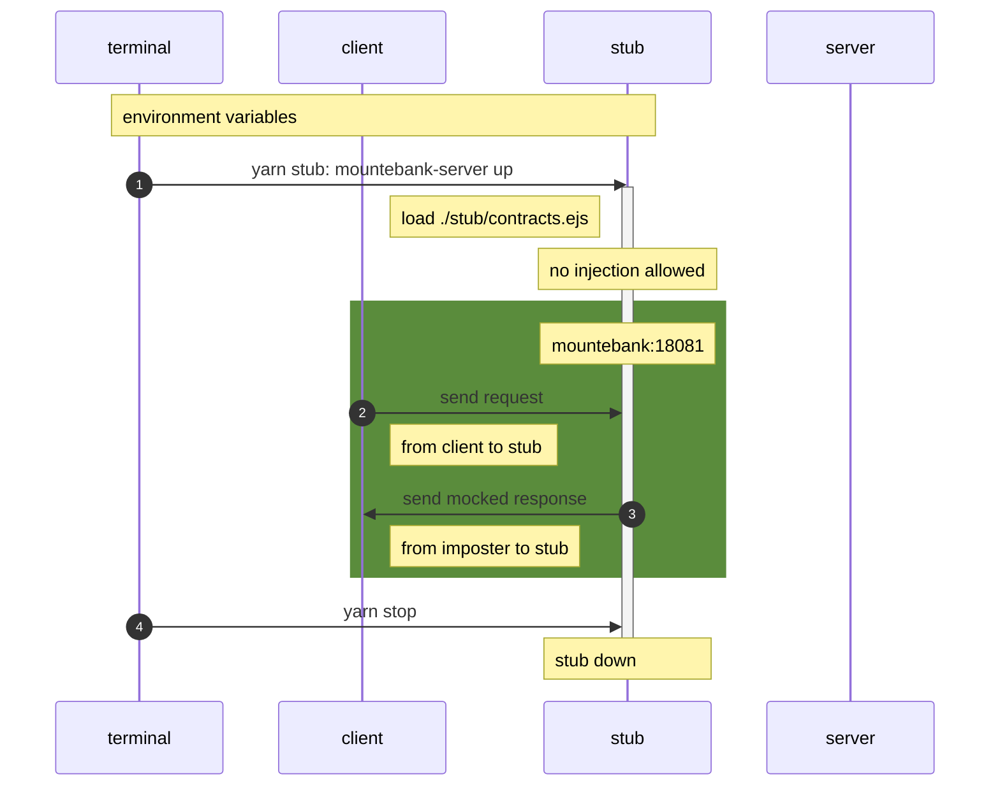

# system-stub

The simple stubbing suite for day1

## Quick Start

```bash
# (option) Refresh caching on Yarn Berry
yarn cache clean # --all

# Prepare dependencies with Yarn Berry
yarn install --check-cache # --immutable --immutable-cache
```

> ### [Caution!]
>
> Cause of using mb(bin) in yarn command, could not shim dotenv.  
> So, use clean ternimal that is not manually set other environment variables.

### Turn `ON` the recording

> _Imposter as a Proxy with Recording HTTP Handshakes._  
> _Check that communicate with the client and the server **through the imposter**._

```bash
# Run a clean imposter
yarn start

# Call to server from client through imposter.
# The client set the this imposter's port number.

# Export recorded data in the running imposter (include backup)
yarn run capture # export at temp/mark-record.ejs

# Stop the running imposter with auto exporting
yarn run stop # export at temp/auto-record.ejs

# Remove all proxies in running imposter
yarn run replay

# Run a memorized imposter
yarn run reload:mark # start from temp/mark-record.ejs
yarn run reload:auto # start from temp/auto-record.ejs
```

Here is the sequence diagram during upper process.



```mermaid
%%{
  init: {
    "fontFamily": "Noto Sans KR, sans-serif",
    "sequence": {
      "showSequenceNumbers": true,
      "noteAlign": "left",
      "noteFontFamily": "Oswald, sans-serif"
    }
  }
}%%
sequenceDiagram
    participant terminal
    participant client
    participant imposter
    participant server

    Note over terminal,imposter: environment variables
    terminal ->> imposter: yarn start: mountebank-server up
    activate imposter
    Note over imposter: active proxies

    rect rgb(90, 140, 60)
    Note over imposter: mountebank:18081
    client ->> imposter: send request
    Note right of client: from client to imposter

    imposter ->> imposter: 
    Note right of imposter: record request data

    rect rgb(35, 50, 90)
    Note over server: server:8081
    imposter ->> server: send request
    Note right of imposter: from imposter to client

    server ->> imposter: send response
    Note right of imposter: from client to imposter

    imposter ->> imposter: 
    Note right of imposter: record response data
    end

    imposter ->> client: send response
    Note right of client: from imposter to client
    end

    terminal ->> imposter: yarn capture
    Note over imposter: save recorded data
    Note right of imposter: ./temp/mark-record.ejs
    

    terminal ->> imposter: yarn replay
    Note over imposter: remove proxies
    rect rgb(90, 140, 60)
    Note over imposter: mountebank:18081

    client ->> imposter: send request
    Note right of client: from client to imposter

    imposter ->> client: send recorded response
    Note right of client: from imposter to client
    end
    terminal ->> imposter: yarn stop
    Note over imposter: imposter down
    deactivate imposter
```

### After record

```bash
# Set environment variable
export $(cat .env) && printenv | grep MB

# Create new stub from recorded data,
# Then replace previous stub with backup.
# (check temp/baks foler)
./replace-stub.sh
```

- check [`stub/`](./stub/) directory

### Turn `ON` the Stub

> _Imposter as a stub with Mocked HTTP Handshakes._  
> _Check that there is **no communication with server**._

```bash
# Set environment variable
export $(cat .env) && printenv | grep MB

# Run a mutable stub
yarn run stub
```

Here is the sequence diagram during upper process.


